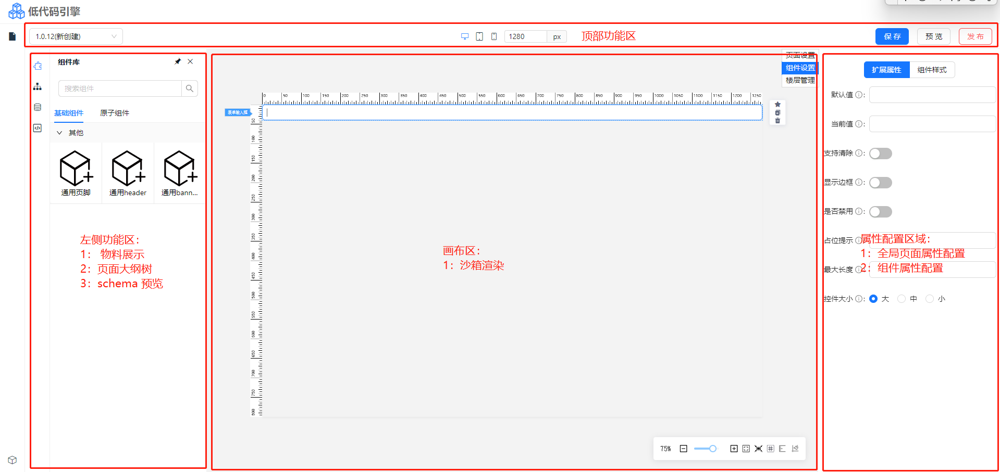
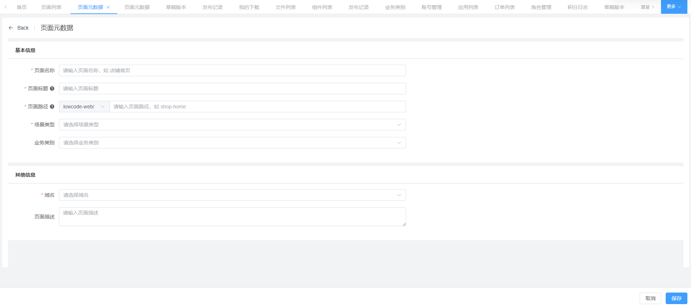
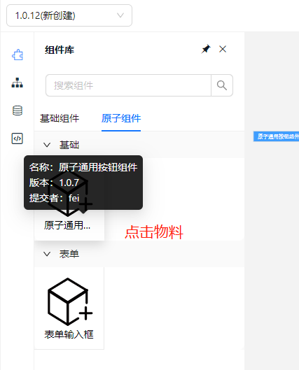
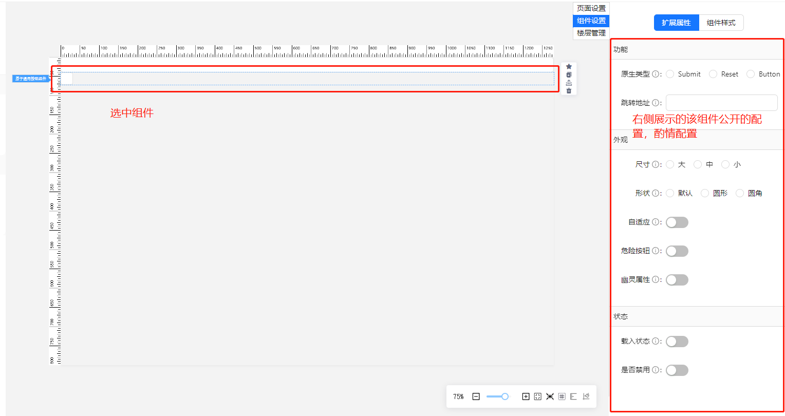

# 平台使用

## 访问地址

低代码引擎的 Demo 可以通过如下永久链接访问到：

[DEMO](https://static-cdn.ry-ltd.site/lowcode-center-web/#/atomManagement/pageManage/list)

## 功能概览

### 数据管理

包括基础的物料、页面、构建产物的维护。

#### 物料维护

#### 页面维护

### 搭建画布

搭建平台的核心部分，包括沙箱渲染、动态表单配置、页面发布等。

设计器承载着低代码平台的核心功能，包括物料开发导入、编排、组件配置、画布渲染、页面打包发布等等。

## 发布第一个页面

### 页面创建

1. 登入平台进入 物料管理\页面管理
2. 点击新增页面，填入基本信息，点击确认，返回页面列表

   

3. 找到刚新建的页面，点击版本 进入该页面的版本列表

   

4. 点击装修，即可进入搭建页面

### 页面搭建

1. 选择左侧物料

   

2. 选中画布组件，配置右侧组件对应的属性

   

### 预览页面

1. 点击右上角预览，会先自动触发页面保存，紧接着会自动打开新 tab, 即可看到搭建的效果
   

### 发布页面

1. 点击右上角发布按钮，会先自动触发页面保存，紧接着会触发服务端打包进行产物的构建

   

2. 返回页面列表，即可看到页面状态已变更为已发布，点击页面路径即可访问刚刚搭建的页面

   

### 产物下载

1. 页面对应的版本列表，点击发布记录，即可进行产物下载，然后在我的下载中可以找到对应的下载任务
   
   
   

   
