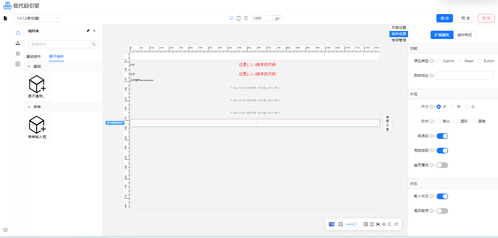

# 简介

## 低代码介绍

零代码、低代码的概念在整个全球行业内已经流行了很长一段时间。通常意义上的低代码定义会有三个关键点：

    1、 一个用于生搭建的可视化编辑器
    2、 包含了一些用于组装的物料，可以通过编排、组合和配置它们以生成丰富的功能或表现
    3、 能降低产品交付的成本

通常情况下低代码平台会具备以下的几个能力：

    1、 可视化页面搭建，通过简单的拖拽完成应用页面开发，对前端技能没有要求或不需要特别专业的了解；
    2、 可视化模型设计，与业务相关的数据存储变得更容易理解，甚至大多数简单场景可以做到表单即模型，模型字段的类型更加业务化；
    3、 能力的开发，包括物料的开发发布、三方接入能力的开发；
    4、 权限、角色设置标准化和业务化，通过策略规则配置来将数据、操作的权限进行精细化管理；

## 低代码引擎介绍

低代码引擎是一款为前端开发、业务交付者提供的平台。

下面简单描述定义中的子部分：

现如今低代码平台越来越多，而每一个低代码平台中都会有的一个能力就是搭建和配置页面、模块的页面，这个页面我们称为设计器。例如，下图是中后台低代码平台的设计器。

设计器承载着低代码平台的核心功能，包括物料开发导入、编排、组件配置、画布渲染、页面打包发布等等。

## 社区解决方案

| 特性/产品 | LowCodeEngine                         | tango                                       | tmagic-editor                                                 |
|-------|---------------------------------------|---------------------------------------------|---------------------------------------------------------------|
| 技术支持  | 阿里                                    | 网易                                          | 腾讯                                                            |
| 产品特点  | 基于 Schema 搭建                          | 基于 code + AST 搭建                            | 基于 Schema + Sandbox 搭建                                        |
| 官方网站  | [官网](https://lowcode-engine.cn/index) | [官网](https://netease.github.io/tango-site/) | [官网](https://tencent.github.io/tmagic-editor/docs/index.html) |

笔者只是列举了几个比较典型的，有大厂背书的平台，大致分为两类，第一类就是以类似 LowCodeEngine 的以 schema 为基础的搭建平台，用户的所有的搭建操作都是编辑 schema, 然后渲染器通过 schema 渲染页面；第二类就是类似 tango 的基于源码 AST 驱动，无私有 DSL 和协议，用户的所有的搭建操作转为对 AST 的遍历和修改，进而将 AST 重新生成为代码，将代码同步给在线沙箱执行。